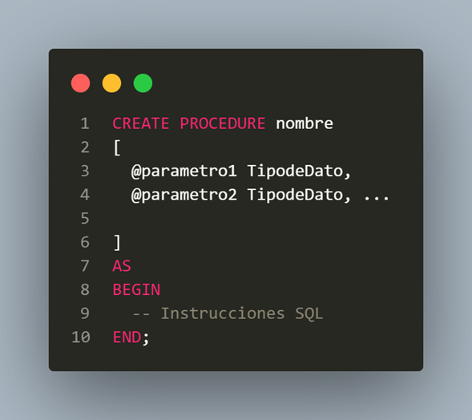

# Stored Procedures (Procedimientos Almacenados) en Transact-SQL (SQL SERVER)
1️⃣ Fundamentos
- Que es un Store Procedure?
Un **Store Procedure (SP)** es un bloque de codigo SQL guardado dentro de la base de datos que puede ejecutarse cuando se necesite. Es decir es un **Objeto de la base de datos**

Es similar a una funcion o metodo en programacion.

Ventajas
1. Reutilizar el codigo
2.Mejor Rendimientos
3. Mayor seguridad
4. Centralizacion de logica de negocio
5. Menos trafico entre aplicacion y servidor



- Nomenclatura Recomendada

```
spu_<Entidad>_<Accion>
```

| Parte   | Significado                     | Ejemplo |
|--------|---------------------------------|--------|
| spu    | Stored Procedure User           | spu_   |
| Entidad| Tabla o concepto del negocio    | Cliente|
| Acción | Lo que hace                     | Insert |

- Acciones Estandar

Estas son las **acciones mas usadas** en sistemas empresariales
| Acción     | Significado          | Ejemplo                |
| ---------- | -------------------- | ---------------------- |
| Insert     | Insertar registro    | spu_Cliente_Insert     |
| Update     | Actualizar           | spu_Cliente_Update     |
| Delete     | Eliminar             | spu_Cliente_Delete     |
| Get        | Obtener uno          | spu_Cliente_Get        |
| List       | Obtener varios       | spu_Cliente_List       |
| Search     | Búsqueda con filtros | spu_Cliente_Search     |
| Exists     | Validar si existe    | spu_Cliente_Exists     |
| Activate   | Activar registro     | spu_Cliente_Activate   |
| Deactivate | Desactivar           | spu_Cliente_Deactivate |

- Ejemplo completo
Suponer que tenemos una tabla Cliente

🪼 Insertar Cliente
```
spu_Cliente_Insert
```
🪼 Actualizar Cliente
```
spu_Cliente_Update
```
🪼 Obtener Cliente por ID
```
spu_Cliente_Get
```
🪼 Listar todos los Cliente
```
spu_Cliente_List
```
🪼 Buscar Cliente
```
spu_Cliente_Search
```

2️⃣ Parametros en Stored Prod=cedures
Los parametros permiten enviar procedimiento
```sql
/*================Stored Procedures =============*/

CREATE DATABASE bdstored;
GO

USE bdstored;
GO

-- Ejemplo Simple

CREATE PROCEDURE usp_Mensaje_Saludar
-- No tendra parametros
AS
BEGIN
PRINT 'Hola Mundo Transact SQL desde SQL SERVER';
END;
GO

-- Ejecutar
EXECUTE usp_Mensaje_Saludar;
GO

-- Saludar 2
CREATE PROC usp_Mensaje_Saludar2;
-- No tendra parametros
AS
BEGIN
PRINT 'Hola Mundo Ing en TI';
END;
GO
-- Ejecutar
EXEC usp_Mensaje_Saludar2;
GO

-- Tercero ( "ALTER" ES PARA MODIFICAR EL NOMBRE)
CREATE OR ALTER PROC usp_Mensaje_Saludar3
-- No tendra parametros
AS
BEGIN
PRINT 'Hola Mundo Enrornos Virtuales y Negocios Digitales';
END;
GO

-- ELIMINAR UN SP
DROP PROCEDURE usp_Mensaje_Saludar3;
GO

-- Ejecutar
EXEC usp_Mensaje_Saludar3;

-- CREAR UN SP que muestre la fecha actual del sistema
CREATE OR ALTER PROC usp_SERVIDOR_FechaActual

AS
BEGIN
SELECT  CAST(GETDATE () AS DATE ) AS [FECHA DEL SISTEMA]
END;
GO

-- EJECUTAR

EXEC usp_SERVIDOR_FechaActual;

-- Crear un SP QUE MUESTRE EL NOMBRE DE LA BASE DE DATOS UTILIZANDO (DB_NAME())
CREATE OR ALTER PROC usp_DB_Nombre

AS
BEGIN
SELECT  DB_NAME() AS [Nombre de la Base de Datos]
END;
GO

-- Ejecutar
EXEC usp_DB_Nombre;

-- Saber el HOST NAME, USUARIO DE SQL
CREATE OR ALTER PROC usp_DB_Nombre

AS
BEGIN
SELECT  
HOST_NAME() AS [MACHINE],
SUSER_SNAME() AS [SQLUSER],
SYSTEM_USER AS [SISTEM USER],
DB_NAME() AS [Nombre de la Base de Datos],
APP_NAME () AS [APPLICATION];
END;
GO
```

```
/*===================================== STORED PROCEDURES CON PARAMETROS=========================================*/
```sql
CREATE OR ALTER PROC usp_persona_saludar
    @nombre VARCHAR(50)-- Parametro de entrada
AS
BEGIN
PRINT 'Hola '+ @nombre;
END;
GO

EXEC usp_persona_saludar 'Elienay';
EXEC usp_persona_saludar @nombre = 'Ivana';
```
```sql
/*--TODO: Ejemplo con consultas,vamos a crear una tabla de clientes basada en la tabla de customers de NORTHWIND*/
SELECT CustomerID, CompanyName
INTO Customers
FROM NORTHWND.dbo.Customers;
GO
/*es para tomar datos de una base de datos*/
--Crear un SP que busque un cliente en especifico
CREATE OR ALTER PROC spu_Customer_buscar
@id NCHAR(10)
AS 
BEGIN
 SET @id = TRIM(@id)
--Primera forma de hacerlo (NEGACION)
    IF LEN(@id)<= 0 OR LEN(@id)<=5
    BEGIN
        PRINT('El ID debe estar en el rango de 1 a 5 de tamaño');
        RETURN;
    END

    IF NOT EXISTS (SELECT 1 FROM Customers WHERE CustomerID = @id)
    BEGIN
        PRINT 'El clientes no existe en la base de datos'
        RETURN;
    END


    SELECT CustomerID, CompanyName AS [Cliente]
    FROM Customers
    WHERE CustomerID=@id;
END;
GO
--Otra forma de hacerlo (NEGACION)
CREATE OR ALTER PROC spu_Customer_buscar
@id NCHAR(10)
AS 
BEGIN

IF EXISTS (SELECT 1 FROM Customers WHERE CustomerID = 'ANTON')
    BEGIN   
    SELECT CustomerID AS [Numero], CompanyName AS [Cliente]
    FROM Customers
    WHERE CustomerID= @id;
    END
    ELSE
        PRINT 'El cliente no existe en la BD'
END;
GO

SELECT *
FROM Customers
WHERE CustomerID= 'ANTON';

--EJECUTAR STORE
EXEC spu_Customer_buscar 'ANTON'


SELECT *
FROM NORTHWND.dbo.Categories
WHERE NOT EXISTS(
SELECT 1
FROM Customers
WHERE CustomerID = 'ANTONI');


-- Ejercicios 
-- 1 Crear un SP que reciba un numero y que verifique que no sea negativo, si es negativo imprimir valor no valido, y si no multiplicarlo por 5 y mostrarlo
-- para mostrarlo usar un SELECT
CREATE OR ALTER PROC usp_numero_multiplicar
    @number INT
AS
BEGIN
    IF @number <= 0
    BEGIN
        PRINT 'El número es negativo ni cero';
        RETURN;
    END
    SELECT (@number * 5 ) AS [OPERACION]
END;
GO
EXEC usp_numero_multiplicar -34;
EXEC usp_numero_multiplicar 0;
EXEC usp_numero_multiplicar 5;
GO

-- Para probarlo:
EXEC usp_MultiplicadorCinco 10;
EXEC usp_MultiplicadorCinco -2; 

-- 2 Crear un SP que reciba un nombre y lo imprima en mayusculas
-- TODO:PARAMETROS DE SALIDA
CREATE OR ALTER PROC usp_nombre_mayusculas
@name VARCHAR (15)
AS
BEGIN
    SELECT UPPER(@name) AS [Name]
END;
GO
EXEC usp_nombre_mayusculas 'elienay';
```

3️⃣Parametros de Salida

Los Parametros OUTPUT devuelven valores al Usuario
```sql
/*forma 1*/
CREATE OR ALTER PROC spu_numeros_sumar
@a INT,
@b INT,
@resultado INT OUTPUT
AS
BEGIN
    SET @resultado=@a+@b
END;
GO
DECLARE @res INT
EXEC spu_numeros_sumar 5,7,@res OUTPUT;
SELECT @res AS[RESULTADO];
/*forma2*/
CREATE OR ALTER PROC spu_numeros_sumar2
@a INT,
@b INT,
@resultado INT OUTPUT
AS
BEGIN
    SELECT @resultado=@a+@b
END;
GO
DECLARE @res INT
EXEC spu_numeros_sumar2 5,7,@res OUTPUT;
SELECT @res AS[RESULTADO];
GO

--Crear un SP que devuelva el area de un circulo
CREATE OR ALTER PROC usp_area_circulo
@radio DECIMAL (10,2),
@area DECIMAL (10,2) OUTPUT
AS
BEGIN
    --SET @area = PI()*@radio *@radio
    SET @area = PI()* POWER(@radio,2);
END;
GO

DECLARE @r DECIMAL (10,2)
EXEC usp_area_circulo 2.4, @r OUTPUT;
SELECT @r AS [Area del circulo];
GO

--Crear un SP que reciba un id de cliente y devuelva el nombre
CREATE OR ALTER PROC spu_cliente_obtener
@id NCHAR(10),
@name NVARCHAR (40) OUTPUT
AS 
BEGIN
    IF LEN(@id) = 5
    BEGIN
    IF EXISTS (SELECT 1 FROM Customers WHERE CustomerID = @id)
    BEGIN
        SELECT @name = CompanyName
        FROM Customers
        WHERE CustomerID = @id;
        RETURN;
        END
        PRINT 'El CUSTOMER no existe';
        RETURN;
    END
    PRINT 'El ID debe ser de tamaño 5';
END
GO

SELECT * FROM Customers;

DECLARE @name NVARCHAR(40)
EXEC spu_cliente_obtener 'AROUT', @name OUTPUT
SELECT @name AS [Nombre del cliente];
```

4️⃣ CASE
Sirve para evaluar condiciones como un SWITCH o IF multiple
```sql
/*===============================CASE=======================================*/
CREATE OR ALTER PROC spu_evaluar_calificacion
@calif INT
AS
BEGIN
    SELECT
        CASE
            WHEN @calif >= 90 THEN 'EXCELENTE'
            WHEN @calif >=70 THEN 'APROBADO'
            WHEN @calif >=60 THEN 'REGULAR'
            ELSE 'NO ACREDITO'
        END AS [RESULTADO];
END;

EXEC spu_evaluar_calificacion 100;
EXEC spu_evaluar_calificacion 50;
EXEC spu_evaluar_calificacion 75;
EXEC spu_evaluar_calificacion 55;
EXEC spu_evaluar_calificacion 65;
GO

---CASE dentro de un SELECT caso real
USE NORTHWND;

CREATE TABLE bdstored.dbo.productos
(
    nombre VARCHAR(50),
    precio money
);

--Inserta los datos basados en la consulta (SELECT) 
INSERT INTO bdstored.dbo.Productos
SELECT ProductName, UnitPrice
FROM NORTHWND.dbo.Products;


SELECT * FROM NORTHWND.dbo.Products;

------------EJERCICIO DEL CASE----------------
SELECT  nombre, 
        precio,
    CASE
        WHEN precio>= 200 THEN 'CARO'
        WHEN precio >=100 THEN 'Precio Medio 🍀'
        ELSE 'BARATO'
    END AS [Categoria]
FROM bdstored.dbo.Productos;


--SELECCIONA LOS CLIENTES, CON SU NOMBRE, PAIS, CIUDAD Y REGION "PERO LOS VALORES NULOS, VISUALIZALOS CON LA LEYENDA SIN REGION" ADEMAS QUIERO QUE TODO EL RESULTADO ESTE EN MAYUSCULAS

USE NORTHWND;
GO
CREATE OR ALTER VIEW vw_buena
AS
SELECT 
    UPPER(CompanyName) AS [CompanyName],
    UPPER(c.Country) AS [Country],
    UPPER(c.City) AS [City],
    UPPER (ISNULL(c.Region, 'Sin Region')) AS [RegionLimpia],
    LTRIM(UPPER(CONCAT(e.FirstName,'',e.LastName))) AS [FULLNAME],
    ROUND(SUM(od.Quantity * od.UnitPrice),2) AS [Total],
  CASE
    WHEN SUM(od.Quantity * od.UnitPrice) >= 30000 AND 
    SUM(od.Quantity * od.UnitPrice) <= 60000 THEN 'GOLD'
    when 
    SUM(od.Quantity * od.UnitPrice) >= 10000 AND 
    SUM(od.Quantity * od.UnitPrice) <= 30000 THEN 'SILVER'
    ELSE 'BRONCE'
    END AS [MEDALLON]
FROM NORTHWND.dbo.Customers AS c
INNER JOIN
NORTHWND.dbo.Orders AS o
ON c.CustomerID = o.CustomerID
INNER JOIN [Order Details] AS od
ON o.OrderID = od.OrderID
INNER JOIN Employees AS e
ON e.EmployeeID = o.EmployeeID
GROUP BY c.CompanyName,c.Country,c.City, c.Region, CONCAT(e.FirstName,'',e.LastName);
GO

CREATE OR ALTER PROC spu_informe_clientes_empleados
@nombre VARCHAR(50),
@region VARCHAR(50)
AS
BEGIN
    SELECT * 
        FROM vw_buena
        WHERE FULLNAME = @nombre 
        AND 
        RegionLimpia = @region;
END;

EXEC spu_informe_clientes_empleados 'ANDREW FULLER', 'Sin region'


------
SELECT 
    UPPER(CompanyName) AS [CompanyName],
    UPPER(c.Country) AS [Country],
    UPPER(c.City) AS [City],
    UPPER (ISNULL(c.Region, 'Sin Region')) AS [RegionLimpia],
    LTRIM(UPPER(CONCAT(e.FirstName,'',e.LastName))) AS [FULLNAME],
    ROUND(SUM(od.Quantity * od.UnitPrice),2) AS [Total],
  CASE
    WHEN SUM(od.Quantity * od.UnitPrice) >= 30000 AND 
    SUM(od.Quantity * od.UnitPrice) <= 60000 THEN 'GOLD'
    when 
    SUM(od.Quantity * od.UnitPrice) >= 10000 AND 
    SUM(od.Quantity * od.UnitPrice) <= 30000 THEN 'SILVER'
    ELSE 'BRONCE'
    END AS [MEDALLON]
FROM NORTHWND.dbo.Customers AS c
INNER JOIN
NORTHWND.dbo.Orders AS o
ON c.CustomerID = o.CustomerID
INNER JOIN [Order Details] AS od
ON o.OrderID = od.OrderID
INNER JOIN Employees AS e
ON e.EmployeeID = o.EmployeeID
WHERE UPPER(CONCAT(e.FirstName,'',e.LastName)) =  UPPER('ANDREWFULLER')
AND UPPER (ISNULL(c.Region, 'Sin Region')) = UPPER('Sin Region')
GROUP BY c.CompanyName,c.Country,c.City, c.Region, CONCAT(e.FirstName,'',e.LastName)
ORDER BY  FULLNAME ASC,[Total] DESC;
```
5️⃣ Try ... Catch
 Manejo de Errores o excepciones en tiempo de ejecucion y manejar lo que sucede cuando ocurren.
SINTAXIS
```sql
BEGIN TRY
    --Codigo que puede generar un error
END TRY

BEGIN CATCH
    --Codigo que se ejecuta si ocurre un error
END CATCH
```
🚮COMO FUNCIONA?
1. SQL ejecuta todo lo que esta dentro del TRY
2. Si ocurre un error :
    -Se detiene la ejecucion del TRY
    -Salta automaticamente al CATCH
3. En el CATCH se puede:
    -Mostrar mensajes
    -Registrar Errores
    -Revertir transacciones

**OBTENER INFORMACION DEL ERROR**
Dentro del CATCH, SQL SERVER tiene funciones especiales:
| FUNCION | DESCRIPCION |
| :--- | :--- |
| ERROR_MENSAGE() | Mensaje de error |
| ERROR_NUMBER() | Numero de error |
| ERROR_LINE() | Linea donde ocurrio |
| ERROR_PROCEDURE()| Procedimiento |
| ERROR_SEVERITY() | Nivel de gravedad |
| ERROR_STATE() | Estado del Error |

```sql
/*============================Manejo de errores con Try...CATCH==========================*/

--Sin TRY-CATCH
SELECT 10/0;
--Con TRY-CATCH
BEGIN TRY
    SELECT 10/0;
END TRY
BEGIN CATCH
    PRINT 'OCURRIO UN ERROR'
END CATCH;
GO

-- EJEMPLO DE USO DE FUNCIONES PARA OBTENER INFORMACION DEL ERROR
BEGIN TRY
    SELECT 10/0;
END TRY
BEGIN CATCH
    PRINT'Mensaje: '+ CAST(ERROR_MENSAGE() AS VARCHAR);
    PRINT 'Numero de Error: '+ CAST(ERROR_NUMBER() AS VARCHAR);
    PRINT 'Linea de ERROR: '+ CAST(ERROR_LINE()AS VARCHAR);
    PRINT 'Procedimiento'+ ERROR_PROCEDURE();
    PRINT 'ESTADO DE ERROR' + CAST(ERROR_STATE()AS VARCHAR);
END CATCH;

CREATE TABLE clientes2(
    id INT PRIMARY KEY,
    nombre VARCHAR(35)
);

INSERT INTO clientes2
VALUES(1,'PANFILO')
GO

BEGIN TRY
INSERT INTO clientes2
VALUES(1,'PANFILO')
END TRY
BEGIN CATCH
END CATCH

--1.
BEGIN TRANSACTION;
--2.
INSERT INTO clientes
VALUES(2,'GOST FUEGO');
--3.
SELECT * 
FROM clientes;
--5. Si terminaste la transaccion
COMMIT;
--4. Si quieres cambiar datos
ROLLBACK;

USE bdstored;
GO

USE bdstored;
GO

-- 1. Si la tabla no existe, la creamos
IF OBJECT_ID('clientes2', 'U') IS NULL
BEGIN
    CREATE TABLE clientes2 (
        id INT PRIMARY KEY,
        nombre VARCHAR(35)
    )
END
GO

-- 2. Bloque de transacción (Asegúrate de ejecutarlo completo)
BEGIN TRY
    BEGIN TRANSACTION
        
        INSERT INTO clientes2 (id, nombre)
        VALUES (3, 'VALDERABANO')

        INSERT INTO clientes2 (id, nombre)
        VALUES (4, 'TAMALES')

    COMMIT TRANSACTION
    PRINT '¡TODO SALIÓ BIEN!'
END TRY
BEGIN CATCH
    IF @@TRANCOUNT > 0
    BEGIN
        ROLLBACK TRANSACTION
        PRINT 'SE HIZO ROLLBACK POR ERROR'
    END
    
    PRINT 'ERROR: ' + ERROR_MESSAGE()
END CATCH
GO
--CREAR UN STORE PROCEDURE QUE INSERTE EN CLIENTE, CON LAS VALIDACIONES NECESARIAS  
CREATE OR ALTER PROC Usp_insetar_cliente
    @id INT,
    @nombre VARCHAR(35)
AS
BEGIN


    BEGIN TRY 
    BEGIN TRANSACTION
    INSERT INTO clientes2
    VALUES (@id,@nombre);
    COMMIT;
    PRINT 'Cliente insertado'
    END TRY
    BEGIN CATCH
    IF @@TRANCOUNT > 1
        BEGIN
        ROLLBACK;
        END
        PRINT'ERROR:'+ERROR_MESSAGE();
    END CATCH
END;


SELECT * FROM clientes2

UPDATE clientes2
SET nombre = 'AMERICO AZUL'
WHERE id = 10

IF @@ROWCOUNT < 1
BEGIN
    PRINT @@ROWCOUNT;
    PRINT 'NO EXITE EL CLEINTE'
END
ELSE 
    PRINT 'CLIENTE ACTUALIZADO'


CREATE TABLE teams
(
    id int not null IDENTITY PRIMARY KEY,
    nombre NVARCHAR(15)
);

SELECT * FROM teams;

INSERT INTO teams (nombre)
VALUES('AMERICA');

--Forma de obtener un IDENTITY INSERTADO FORMA 1
DECLARE @id_insertado INT
SET @id_insertado = @@IDENTITY
PRINT 'ID INSERTADO:'+CAST(@id_insertado AS VARCHAR);
SELECT @id_insertado = @@IDENTITY 
PRINT 'ID INSERTADO FORMA 2: '+ CAST(@id_insertado AS VARCHAR);

--Forma de obtener un IDENTITY INSERTADO FORMA 2
DECLARE @id_insertado2 INT
SET @id_insertado2 = SCOPE_IDENTITY();
PRINT 'ID INSERTADO:'+CAST(@id_insertado2 AS VARCHAR);
SELECT @id_insertado2 = SCOPE_IDENTITY() 
PRINT 'ID INSERTADO FORMA 2: '+ CAST(@id_insertado2 AS VARCHAR);
```